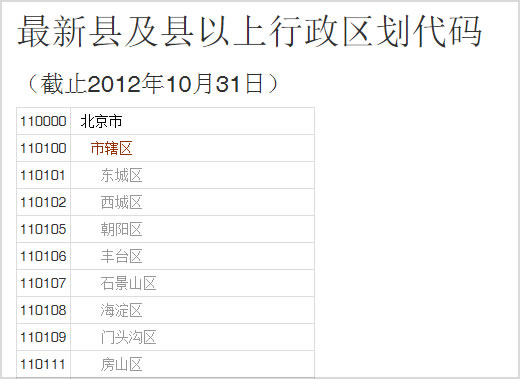
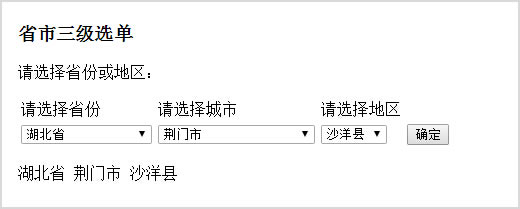

## 最新县及县以上行政区划代码

根据[国家统计局发布的行政区划代码](http://www.stats.gov.cn/zjtj/tjbz/xzqhdm/)整理（截止2012年10月31日）

顺序是按照邮编排列的

## 整理好的数据 ##

要根据实际情况处理港澳台的数据

	data/行政区划代码.xml
	data/行政区划代码.json
	data/area.xml    早期下载的一份数据

### 附上两个例子 ###

	城市省市二级联动选单
	example/cityselect.html
	直辖市的二级选单调整为市辖区辖县

	城市省市三级联动选单
	example/cityselect_3.html
	调用json数据

	城市省市列表
	example/list.html
	调用json数据

